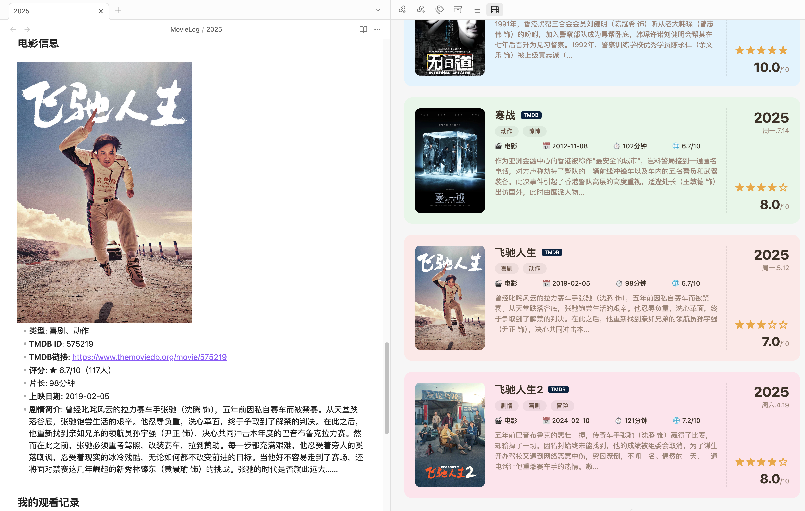

# MovieLog

An Obsidian plugin for tracking your movie and TV series watching history. Fetches media information via TMDB API, generates structured watch records, and displays them in a card wall view.

[中文版本请参阅 README_zh.md](https://github.com/zzditto/MovieLog/blob/main/README_zh.md)

## Features

- **TMDB Search**: Search movies and TV series via command palette, automatically fetch metadata
- **Templated Records**: Auto-generate Markdown files with posters, ratings, synopsis, etc.
- **Series Support**: Track TV series by season, including episode lists and watch progress
- **Card Wall View**: Browse all watch records in a visual card grid
- **Personal Fields**: Fill in your thoughts, personal rating, watch platform, watch status, etc.

## Preview



## Installation

### Method 1: Install from Obsidian Community Plugins (Recommended)

1. Open Obsidian → Settings → Community Plugins → Browse
2. Search for "MovieLog"
3. Click Install and Enable

### Method 2: Manual Installation

1. Download the latest `main.js`, `manifest.json`, `styles.css` from [Releases](https://github.com/zzditto/MovieLog/releases)
2. Create the plugin directory in your Obsidian vault:
   ```
   {your vault}/.obsidian/plugins/movielog/
   ```
3. Copy the three downloaded files into that directory
4. Open Obsidian → Settings → Community Plugins → Enable MovieLog

### Method 3: Build from Source

```bash
# Clone the repository
git clone https://github.com/zzditto/MovieLog.git
cd movielog

# Install dependencies
npm install

# Build
npm run build

# Copy to your Obsidian vault
cp main.js manifest.json styles.css /path/to/your/vault/.obsidian/plugins/movielog/
```

## Configuration

1. Open Obsidian → Settings → Community Plugins → MovieLog
2. Enter your TMDB API Key:
   - Sign up at [themoviedb.org](https://www.themoviedb.org/signup)
   - Get your API Key from [API Settings](https://www.themoviedb.org/settings/api)
3. Configure other options:
   - **Default Save Folder**: Directory for watch records (default: `MovieLog`)
   - **TMDB Language**: Metadata language (default: Simplified Chinese)
   - **Card Size**: Display size of cards in the card wall
   - **Sort By**: Sort by watch date, title, rating, or release date

## Usage

### Add Movie Record

1. Press `Ctrl+P` (`Cmd+P` on macOS) to open the command palette
2. Type `MovieLog: Add Movie Record`
3. Enter the movie name and search
4. Select the movie from the result list
5. A Markdown file with complete information is auto-generated
6. Fill in your thoughts, rating, and other personal fields

### Add TV Series Record

1. Open the command palette, type `MovieLog: Add TV Series Record`
2. Search for the TV series name
3. After selecting the series, choose the season to record
4. A file with series information and episode list is auto-generated
5. Update watch progress and your thoughts

### View Card Wall

1. Click the movie icon in the left sidebar
2. Or use the command palette and type `MovieLog: Open Card Wall`
3. Browse all watch records, click a card to jump to the corresponding file

## License

MIT License